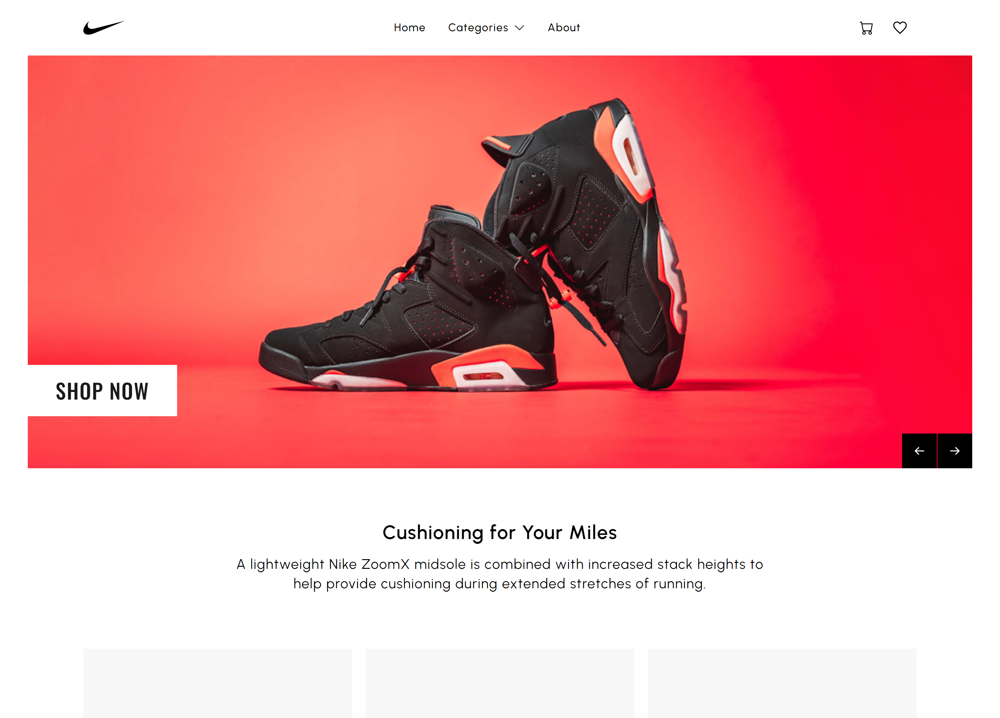

# Shoe Store

<a href="https://shoe-store-sid.vercel.app/" target="_blank">Demo</a>

 

## 💻 Sobre

O Shoe Store é um projeto de E-commerce de tênis Air Jordan da Nike, construído com o objetivo de oferecer uma experiência de compra fácil e agradável para os usuários. A plataforma foi desenvolvida utilizando o framework Next.js e o Strapi como Headless CMS. A estrutura do Next 12 com Context API, Redux e Tailwind foi utilizada para garantir uma interface de usuário rápida e responsiva. O Stripe foi utilizado para processar pagamentos e garantir segurança nas transações. No geral, o Shoe Store busca oferecer uma plataforma de E-commerce e que seja fácil de navegar e que ofereça uma experiência de compra simplificada para os usuários. Vale Ressaltar que o projeto esta totalmente em ingles.

O projeto não foi feito totalmente por min, peguei boa parte da estilização do [Js Dev](https://www.instagram.com/jsdev_official/), agradeço a ele por disponibilizar essa parte.

